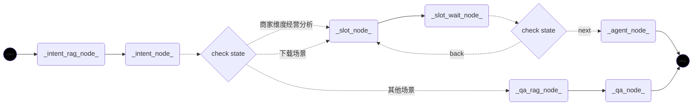

难点：
1. 意图澄清怎么返回
2. 参数澄清呢

```mermaid
flowchart LR
	__START__((start))
	__END__((stop))
	_intent_rag_node_("_intent_rag_node_")
	_intent_node_("_intent_node_")
	_slot_node_("_slot_node_")
	_slot_wait_node_("_slot_wait_node_")
	_qa_rag_node_("_qa_rag_node_")
	_qa_node_("_qa_node_")
	_agent_node_("_agent_node_")
	condition1{"check state"}
	condition2{"check state"}
	__START__:::__START__ --> _intent_rag_node_:::_intent_rag_node_
	_intent_rag_node_:::_intent_rag_node_ --> _intent_node_:::_intent_node_
	_intent_node_:::_intent_node_ -.-> condition1:::condition1
	condition1:::condition1 -.->|其他场景| _qa_rag_node_:::_qa_rag_node_
	%%	_intent_node_:::_intent_node_ -.->|其他场景| _qa_rag_node_:::_qa_rag_node_
	condition1:::condition1 -.->|商家维度经营分析| _slot_node_:::_slot_node_
	%%	_intent_node_:::_intent_node_ -.->|商家维度经营分析| _slot_node_:::_slot_node_
	condition1:::condition1 -.->|下载场景| _slot_node_:::_slot_node_
	%%	_intent_node_:::_intent_node_ -.->|下载场景| _slot_node_:::_slot_node_
	_slot_node_:::_slot_node_ --> _slot_wait_node_:::_slot_wait_node_
	_slot_wait_node_:::_slot_wait_node_ -.-> condition2:::condition2
	condition2:::condition2 -.->|next| _agent_node_:::_agent_node_
	%%	_slot_wait_node_:::_slot_wait_node_ -.->|next| _agent_node_:::_agent_node_
	condition2:::condition2 -.->|back| _slot_node_:::_slot_node_
	%%	_slot_wait_node_:::_slot_wait_node_ -.->|back| _slot_node_:::_slot_node_
	_agent_node_:::_agent_node_ --> __END__:::__END__
	_qa_rag_node_:::_qa_rag_node_ --> _qa_node_:::_qa_node_
	_qa_node_:::_qa_node_ --> __END__:::__END__

	classDef __START__ fill:black,stroke-width:1px,font-size:xx-small;
	classDef __END__ fill:black,stroke-width:1px,font-size:xx-small;
```